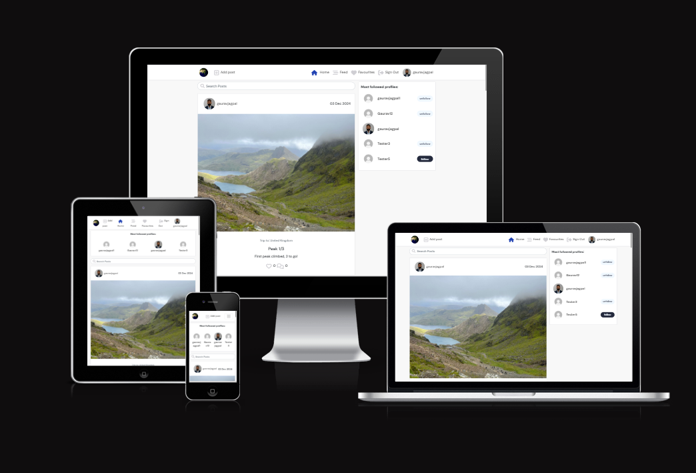
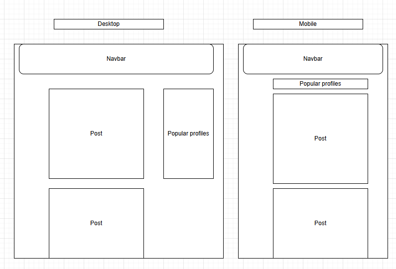
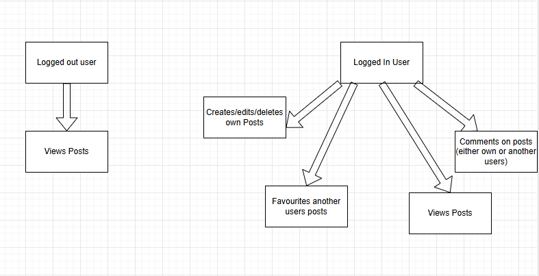

# Plan-et Continentally

### Am I responsive

Portfolio 5 project as part of the Diploma in Full Stack Software Development by Code Institute. This project uses:
- HTML, CSS, JavaScript
- React.js
- Bootstrap.js
- Django REST Framework

___

Plan-et Continentally is a site that lets users post pictures of their holidays and get ideas for things to do when planning a trip. A user who has signed up can favourite and comment on posts or follow other accounts who give them inspiration.

Link to live site - [Plan-et Continentally](https://plan-et-continentally-d407d6f9ae7a.herokuapp.com/)

Link to backend github - [Back End](https://github.com/gauravjagpal/drf-api-project5)

## CONTENTS
- [Plan-et Continentally](#plan-et-continentally)
    - [Am I Responsive](#am-i-responsive)
  - [CONTENTS](#contents)
  - [Site Objectives](#site-objectives)
- [User Experience/UX](#user-experienceux)
  - [Target Audience](#target-audience)
  - [User Stories](#user-stories)
- [Design Choices](#design-choices)
  - [Colour Scheme](#colour-scheme)
  - [Typography](#typography)
  - [Logo and Favicon](#logo-and-favicon)
  - [Wireframes](#wireframes)
  - [Flow Diagram](#flow-diagram)
- [Features](#features)
  - [Registration](#registration)
  - [Future Features](#future-features)
- [Technologies Used](#technologies-used)
- [Programming Languages, Frameworks and Libraries Used](#programming-languages-frameworks-and-libraries-used)
- [Agile](#agile)
- [Testing](#testing)
- [Deployment](#deployment)
  - [Github Deployment](#github-deployment)
  - [Cloning and Forking](#cloning-and-forking)
  - [Repository deployment via Heroku](#repository-deployment-via-heroku)
  - [Deployment of the app](#deployment-of-the-app)
- [Credits](#credits)

## Site Objectives

Design and create a review site to demonstrate an increasing understanding of the libraries and frameworks available to developers.

My three main objectives were:

- ### Create a readable, clean and responsive front end 

I wanted to make a site that is easy to access and navigate for the users. React was used to style the front end application

- ### Make use of available backend functionality

  The use of the backend framework allows users to create a profile, leave a review and/or edit any of the books on the site (with authorisation), as well as deleting their own comments should they wish to. CORS were used to achieve this

  - ### Store data on an external cloud database

  I used a PostgreSQL database for this project Django frameworks were used to achieve this.

# User Experience/UX

## Target Audience

- Users who are interested in travelling and looking for inspiration/ideas for their trip

## User Stories

### Visitor Goal
- View different posts from different users
- View all posts
- Create an account and engage with the site and other users and site owner.
- Log in and out of their account.
- Read posts and comments
- Leave a comment and favourite a post

# Design Choices

## Typography

The main font used is DM Sans with a backup of sans serif

## Logo and Favicon
The logo was chosen as a globe to represent travel
- Homepage, Feed and favourites Wireframes

## Wireframes

## Flow Diagram

Here is a diagram showing the possible flow through the site. On the left side you can see what the super user can expect to do. On the right hand side you can see what someone who signs up as a user can expect.

# Features
## Registration

A user should be able to:
- The user can create an account
- View Posts on Home Page
- Leave a comment on Post.
- Follow their favourite users

## Future Features
- Add a share feature to send posts to friends
- Add more filters, such as a city and country 

# Technologies Used

Here are the technologies used to build this project:

- [Github](https://github.com) To host and store the data for the site.
- [Gitpod](https://gitpod.io/workspaces), the IDE where the site was built.
- [PEP8 Validator](https://pep8ci.herokuapp.com/) Used to check python code for errors
- [PostgresSQL](https://dbs.ci-dbs.net/) Used to store PostgreSQL database.
- [Cloudinary](https://cloudinary.com/) Used as cloud storage for images uploaded as part of the blog posts
- [Heroku](https://id.heroku.com/) Used to deploy the project

# Programming Languages, Frameworks and Libraries Used

- [HTML](https://developer.mozilla.org/en-US/docs/Web/HTML)
- [CSS](https://developer.mozilla.org/en-US/docs/Learn/Getting_started_with_the_web/CSS_basics)
- [Python](https://en.wikipedia.org/wiki/Python_(programming_language))
- [Django](https://www.djangoproject.com/)
- [Bootstrap](https://getbootstrap.com/)
- [JavaScript](https://www.javascript.com/)
- [React](https://react-bootstrap-v4.netlify.app/)

# Agile

This project was designed using Agile methodology, utilising the Project Board and Issues sections in GitHub

- [Project Board](https://github.com/users/gauravjagpal/projects/3)

# Deployment
## Dev environment
To run the app in a dev evnironment I would do the following:

### `npm start`

Runs the app in the development mode.\
Open [http://localhost:3000](http://localhost:3000) to view it in the browser.

The page will reload if you make edits.\
You will also see any lint errors in the console.

## Github Deployment

The website was stored using GitHub for storage of data and version control. To do this I did the following;

After each addition, change or removal of code, in the terminal within your IDE (I used Gitpod for this project) type:

- git add .
- git commit -m "meaningful commit message"
- git push

The files are now available to view within my github repository.

To bring all models up to date I regularly needed to run:
- python3 manage.py makemigrations
- python3 manage.py migrate

Whenever I made changes to my CSS or JavaScript files I needed to run:
- python3 manage.py collectstatic

## Cloning and Forking
### How to Clone

To clone the repository:

1. Login (or signup) to Github.
2. Go to my repository for the project, [gauravjagpal/plan-et-continentally](https://github.com/gauravjagpal/plan-et-continentally).
3. Click on the green 'Code' button. Choose whether you would like to clone with HTTPS, SSH, or GitHub CLI, and copy the link shown.
4. Launch the terminal within your code editor and set the current working directory to the desired location for the cloned directory.
5. Type 'git clone' into the terminal and then paste the link you copied in step 3. Press enter.

### How to Fork

To fork the repository:

1. Login (or signup) to Github.
2. Go to my repository for the project, [gauravjagpal/plan-et-continentally](https://github.com/gauravjagpal/plan-et-continentally).
3. Click the Fork button in the top right corner.

### Repository deployment via Heroku

- On the [Heroku Dashboard](https://dashboard.heroku.com) page, click New and then select Create New App from the drop-down menu.
- When the next page loads insert the App name and Choose a region. Then click 'Create app'
- In the settings tab click on Reveal Config Vars and add the key Port and the value 8000. The credentials for this app were:

1. Cloudinary URL
2. Database URL
3. SECRET_KEY

- Below this click Add buildpack and choose python.

### Deployment of the app

- Click on the Deploy tab and select Github-Connect to Github.
- Enter the repository name and click Search.
- Choose the repository that holds the correct files and click Connect.
- A choice is offered between manual or automatic deployment whereby the app is updated when changes are pushed to GitHub. Select automatic (when testing you can also choose to do a manual refresh to speed things up)
- Once the deployment method has been chosen the app will be built and can be launched by clicking the Open app button which will either appear below the build information window or in the top right of the page.

___

## Credits

This project was based on the Code Institute's - I think therefore I blog walkthrough module which provided a standard blog 'base'. I used this template and manipulated it into a review site for books, changing view, models and HTML/CSS along the way.

When running into blockers I often referred to Stack Overflow for inspiration

The wireframe mockups were created using [Balsamiq](https://balsamiq.cloud/)