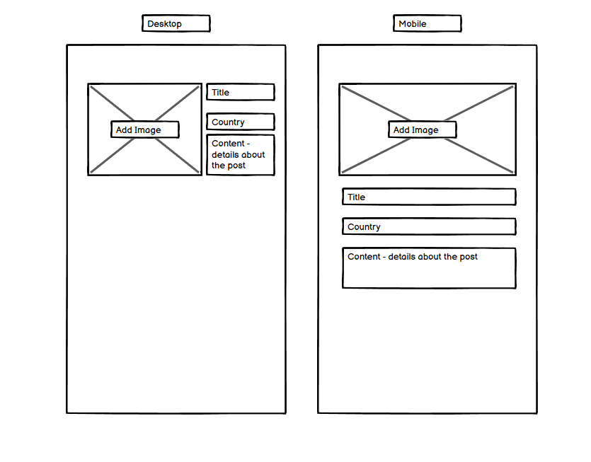
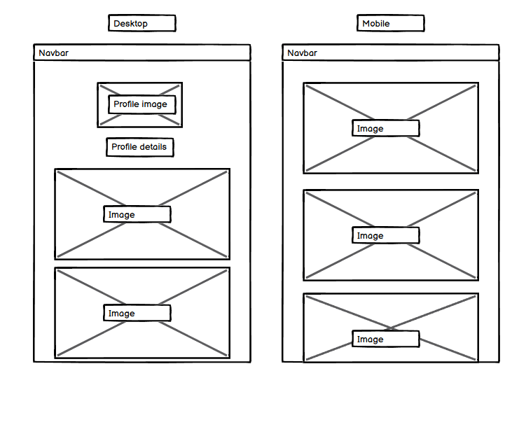
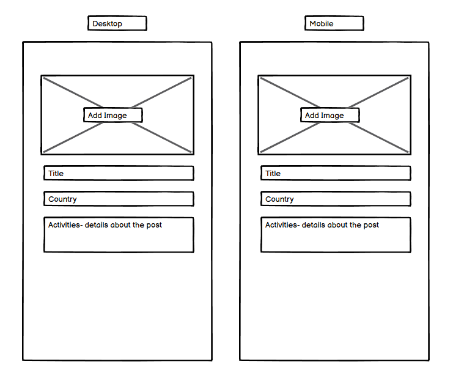
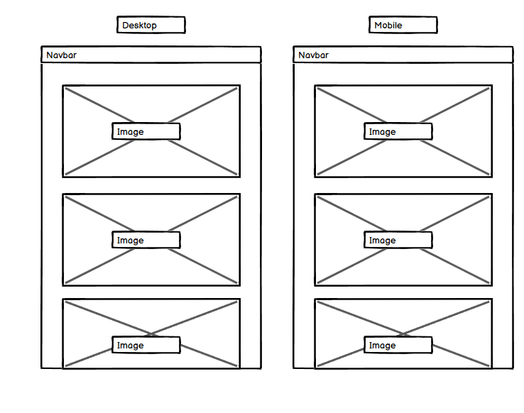
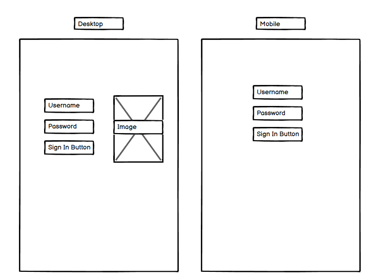
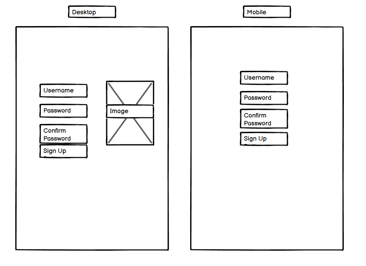

# Plan-et Continentally

### Am I responsive

Portfolio 5 project as part of the Diploma in Full Stack Software Development by Code Institute. This project uses:
- HTML, CSS, JavaScript
- React.js
- Bootstrap.js
- Django REST Framework

___

Plan-et Continentally is a site that lets users post pictures of their holidays and get ideas for things to do when planning a trip. A user who has signed up can favourite and comment on posts or follow other accounts who give them inspiration.

An about page has been created for a user to read more about the site to understand the objectives.

Link to live site - [Plan-et Continentally](https://plan-et-continentally-d407d6f9ae7a.herokuapp.com/)

Link to about page - [Plan-et Continentally About page](https://plan-et-continentally-d407d6f9ae7a.herokuapp.com/about)

Link to backend github - [Back End](https://github.com/gauravjagpal/drf-api-project5)

## Contents
- [Plan-et Continentally](#plan-et-continentally)
    - [Am I Responsive](#am-i-responsive)
  - [Contents](#contents)
  - [Site Objectives](#site-objectives)
- [User Experience/UX](#user-experienceux)
  - [Target Audience](#target-audience)
  - [User Stories](#user-stories)
- [Design Choices](#design-choices)
  - [Colour Scheme](#colour-scheme)
  - [Typography](#typography)
  - [Logo and Favicon](#logo-and-favicon)
  - [Wireframes](#wireframes)
  - [Flow Diagram](#flow-diagram)
- [Features](#features)
  - [Registration](#registration)
  - [Future Features](#future-features)
- [Technologies Used](#technologies-used)
- [Programming Languages, Frameworks and Libraries Used](#programming-languages-frameworks-and-libraries-used)
- [Agile](#agile)
- [Testing](#testing)
- [Deployment](#deployment)
  - [Github Deployment](#github-deployment)
  - [Cloning and Forking](#cloning-and-forking)
  - [Repository deployment via Heroku](#repository-deployment-via-heroku)
  - [Deployment of the app](#deployment-of-the-app)
- [Credits](#credits)

## Site Objectives

Users should be able to create posts their trips and engage with other users trips (which will only be for their eyes).
They can follow their favourite accounts and view posts by them on the feed page, or favourite a post and view all favourited posts on the favourites page.

My three main objectives were:

- ### Create a readable, clean and responsive front end 

  I wanted to make a site that is easy to access and navigate for the users. React was used to style the front end application

- ### Make use of available backend functionality

  The use of the backend framework allows users to create a profile, leave a review and/or edit any of the books on the site (with authorisation), as well as deleting their own comments should they wish to. CORS was used to achieve this

- ### Store data on an external cloud database

  I used a PostgreSQL database for this project. The Django framework was used to achieve this.

# User Experience/UX

## Target Audience

- Users who are interested in travelling and looking for inspiration/ideas for their trip

## User Stories

### Visitor Goal
- View different posts from different users
- View all posts
- Create an account and engage with the site and other users.
- Log in and out of their account.
- Read posts and comments
- Leave a comment and favourite a post
- Start planning their own trips (this is a private section so that a user can plan their trips having taken ideas from the posts they have viewed. This will become open to people they have invited to their trip in future releases)

# Design Choices
## Colour Scheme
I have chosen a fairly neutral colour scheme, with the 3 colours being white for a clean look
and grey and blue for a contrasting and professional finish

## Typography

The main font used is DM Sans with a backup of sans serif

## Logo and Favicon
The logo was chosen as a globe to represent travel, this is also the favicon

# Wireframes
## Home page. Feed and Favourites Wireframes
During the initial build plan, the below was the intended design. After development began, I decided to add the search bar feature.

## Add Post Wireframe

## Profile page Wireframe

## Add Trip Wireframe

## Trips Wireframe

## Sign In Page

## Sign In Page

## Flow Diagram

Here is a diagram showing the possible flow through the site. On the left side you can see what the super user can expect to do. On the right hand side you can see what someone who signs up as a user can expect.

# Features

## CRUD functionality
TribeHub features full Create, Read, Update and Delete functionality, via the UI implemented in React and the Django Rest Framework API.

## User options
A user should be able to:
- The user can create an account
- View Posts on Home Page
- Leave a comment on a Post.
- Follow their favourite users
- Add a trip - this will be private
- Edit a trip - this will be private

## Future Features
- Add a share feature to send posts to friends
- Add more filters, such as a continent and city
- Add a collaboration feature so you can add friends to your trip section
the idea of this section is for a user to be able to plan their trip with friends
- Add a way a user can reset their password
- Add accomodation options/links/suggestions

# Agile

This project was designed using Agile methodology, utilising the Project Board and Issues sections in GitHub.
Through each iteration of feedback received, new story points were added and worked on.

- [Project Board](https://github.com/users/gauravjagpal/projects/3)

# Technologies Used

Here are the technologies used to build this project:

- [Github](https://github.com) To host and store the data for the site.
- [Gitpod](https://gitpod.io/workspaces), the IDE where the site was built.
- [PEP8 Validator](https://pep8ci.herokuapp.com/) Used to check python code for errors
- [PostgresSQL](https://dbs.ci-dbs.net/) Used to store PostgreSQL database.
- [Cloudinary](https://cloudinary.com/) Used as cloud storage for images uploaded as part of the blog posts
- [Heroku](https://id.heroku.com/) Used to deploy the project

# Programming Languages, Frameworks and Libraries Used

- [HTML](https://developer.mozilla.org/en-US/docs/Web/HTML)
- [CSS](https://developer.mozilla.org/en-US/docs/Learn/Getting_started_with_the_web/CSS_basics)
- [Python](https://en.wikipedia.org/wiki/Python_(programming_language))
- [Django](https://www.djangoproject.com/)
- [Bootstrap](https://getbootstrap.com/)
- [JavaScript](https://www.javascript.com/)
- [React](https://react-bootstrap-v4.netlify.app/)

## Libraries
### React-Router-DOM
- [react-router-dom](https://www.npmjs.com/package/react-router-dom) - this library enables 'client side routing' for React web applications, and is used to implement basic routing in TribeHub, i.e. to implement the links on the bottom navbar, and register, sign-in and sign-out links. Using React-Router-DOM also enabled implementation of 'single page mode'to enhance the experience for users on larger screens. The `useSinglePage` custom hook is referenced in `App.js`, with different `Route` components conditionally rendered for the various paths depending on whether the app is running in single page mode. The `useLocation` hook from React-Router-DOM is used in some components to determine the current URL and respond accordingly, for example by ensuring the correct nav button is highlighted in the bottom navbar for mobile users.

### ReactDOM
- [react-dom](https://reactjs.org/docs/react-dom.html) - react-dom is used to manipulate the DOM outside of a specific component, and supports the user experience by enabling modal dialogs to be appended to the top level of the DOM (important for accessability) and alerts to be appended to specific components. For example, notifications are fetched by the NotificationsMenu component, but this takes the form of a dropdown menu, so using ReactDOM allows the component to 'reach out' into the DOM and display error alerts in a more obvious location than inside the dropdown.

### Axios
- [Axios](https://www.npmjs.com/package/axios) - the axios library was chosen to simplify making HTTP requests to the REST API (e.g. not having to manually configure HTTP headers), and because it enables simple implementation of 'interceptors' which are used to request a refresh token in the event of a HTTP 401 error. This enhances the user experience beacuse an authenticated user remains signed in for up to 24 hours, rather than having to sign in again after five minutes.

### JWT Decode
- [jwt-decode](https://www.npmjs.com/package/jwt-decode) - used to decode Base64URL encoded JSON web tokens.

### React Bootstrap Icons
- [React Bootstrap Icons](https://www.npmjs.com/package/react-bootstrap-icons) - this icon library was selected for the high quality and simplicity of the icons, and easy integration with React.

## React features used to enhance user experience
### Custom hooks
The `useSingle` page custom hook is used throughout the app so that components can check whether the app is currently running in 'single page' mode, and render themselves accordingly, for example by applying appropriate CSS classes for the 'mobile' versus 'single page' views. Many components are reliant on a `useCurrentUser` hook to determine whether the current user is authenticated, and to obtain various details about the user such as profile image, display name and whether they have tribe admin status. 

# Testing
Please refer to [TESTING.md](TESTING.md) file for all testing carried out for the front end. 

All [Backend Testing](https://github.com/gauravjagpal/drf-api-project5/blob/main/README.md) has been documented here.

# Deployment
## Dev environment
To run the app in a dev environment I would do the following:

### `nvm install 16 && nvm use 16`
### `npm run start`

Runs the app in the development mode.\
Open [http://localhost:3000](http://localhost:3000) to view it in the browser.

The page will reload if you make edits.\
You will also see any lint errors in the console.

## Github Deployment

The website was hosted on GitHub for version control and data storage. To do this I did the following;

After each addition, change or removal of code, in the terminal within your IDE (I used Gitpod for this project) type:

- git add .
- git commit -m "meaningful commit message"
- git push

The files are now available to view within my github repository.

#### For the back end 
To bring all models up to date I regularly needed to run:
- python3 manage.py makemigrations
- python3 manage.py migrate

Whenever I made changes to my CSS or JavaScript files, I needed to run::
- python3 manage.py collectstatic

## Cloning and Forking
### How to Clone

To clone the repository:

1. Login (or signup) to Github.
2. Go to my repository for the project, [gauravjagpal/plan-et-continentally](https://github.com/gauravjagpal/plan-et-continentally).
3. Click on the green 'Code' button. Choose whether you would like to clone with HTTPS, SSH, or GitHub CLI, and copy the link shown.
4. Launch the terminal within your code editor and set the current working directory to the desired location for the cloned directory.
5. Type 'git clone' into the terminal and then paste the link you copied in step 3. Press enter.

### How to Fork

To fork the repository:

1. Login (or signup) to Github.
2. Go to my repository for the project, [gauravjagpal/plan-et-continentally](https://github.com/gauravjagpal/plan-et-continentally).
3. Click the Fork button in the top right corner.

### Repository deployment via Heroku

- On the [Heroku Dashboard](https://dashboard.heroku.com) page, click New and then select Create New App from the drop-down menu.
- When the next page loads insert the App name and Choose a region. Then click 'Create app'
- In the settings tab click on Reveal Config Vars and add the key Port and the value 3000. The credentials for this app were:

1. Cloudinary URL
2. Database URL
3. SECRET_KEY

- Below this click Add buildpack and choose python.

### Deployment of the app

- Click on the Deploy tab and select Github-Connect to Github.
- Enter the repository name and click Search.
- Choose the repository that holds the correct files and click Connect.
- A choice is offered between manual or automatic deployment whereby the app is updated when changes are pushed to GitHub. Select automatic (when testing you can also choose to do a manual refresh to speed things up)
- Once the deployment method has been chosen the app will be built and can be launched by clicking the Open app button which will either appear below the build information window or in the top right of the page.

___

## Credits

This project was based on the Code Institute's - moments walkthrough module which provided a standard social media 'base'. I used this template and adapted it to be more related to travel.

When running into blockers I often referred to Stack Overflow for inspiration

The wireframe mockups were created using [Balsamiq](https://balsamiq.cloud/)