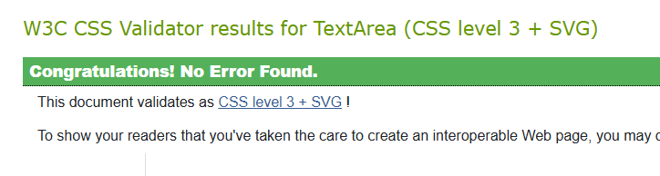
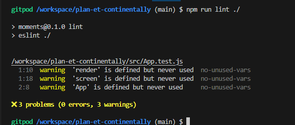
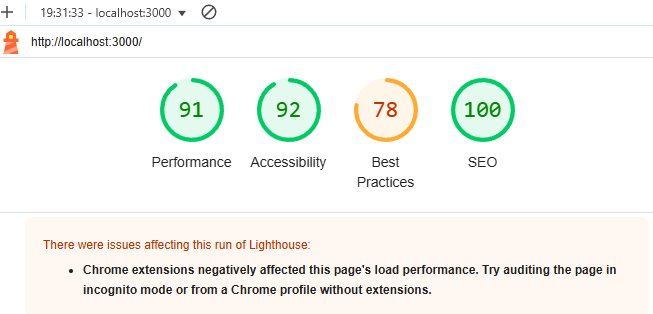
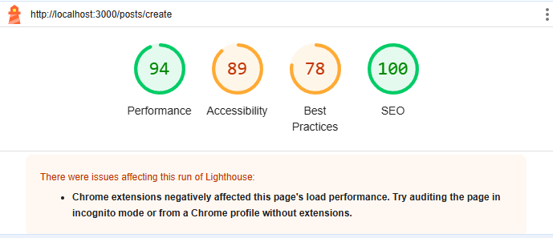
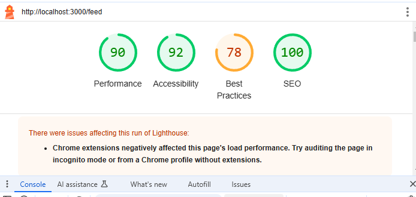
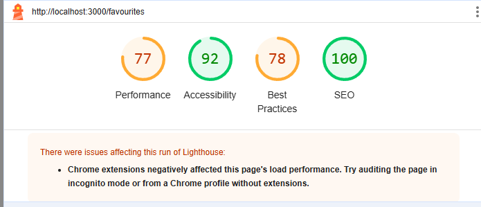
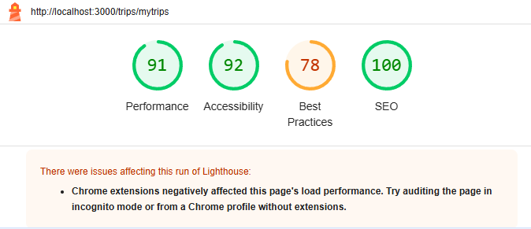

## Testing

Manual tests were devised for each user story to be implemented for the project. 
These were performed on the final, deployed version of the site and are documented on the [Plan-et Continentally user stories spreadsheet](https://1drv.ms/x/c/99b42fbd0ef8a7c3/ERf_AycLBKlNg9i_jQMK8AcBLNqZYBFBjVuh_U6ii_uiHg?e=S6J7Pa).

Several tests failed on the first attempt. In these cases, details of how the issues were addressed and the outcome of further testing are provided. All tests were passed after issues were resolved.

In addition, the site was deployed early and subject to continual user testing throughout the development process. This resulted in a number of enhancements to the user experience, which are documented and explained in other areas, such as the wireframes not initially having a search bar.

### Validator testing
### W3C CSS validator

All CSS files were passed through teh W3C CSS validator and the following message was returned for each one.

### ESLint validator
When testing using ESLint, I got the below error messages:

These errors are expected as they were commented out during testing. However to ensure no warnings, these were all permanently commented out.

### Lighthouse testing

### Home Page Lighthouse test

### Add post Lighthouse test

### Feed Lighthouse test

### Favourites Lighthouse test

### Add Trip Lighthouse test

### Trips Lighthouse test

### Solved Bugs

| No | Bug | How I solved the issue |
| :--- | :--- | :--- |
| 1 | Navbar dropdown was not working in mobile view. | I corrected this by adding a media query and removing it from the dropdown. |
| 2 | Editing a Country was not working in both the EditTrips and EditPosts. | This was to do with how I was referencing them in both the serializers in the back and the country codes in the front end
| 3 | Trips rendering all users | Backend Filter fieldsets was not set correctly |
| 4 | Searching for a trip | Backend search fields were not set in views |

### Unresolved bugs
- Users accessing TribeHub from iOS devices, Safari on MacOS, Samsung Internet on Samsung devices and possibly others must turn off 'Prevent Cross Site Tracking' (Apple devices), 'Smart Anti-Tracking' (Samsung devices) or other similar features in order to use the web app. This is because the Django Rest Framework API and the React front-end are hosted on separate domains using Heroku, and cross-domain requests from the front-end to the API are blocked by these anti-tracking features. It appears there is no solution to this, other than to host the API and front-end on the same domain (reference - https://stackoverflow.com/questions/56972162/is-there-a-workaround-for-safari-ios-prevent-cross-site-tracking-option-when).
