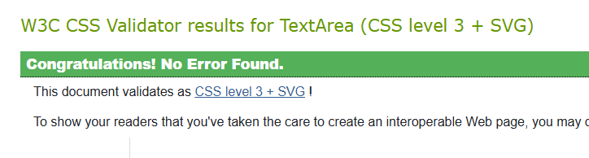

## Testing

Manual tests were devised for each user story to be implemented for the project. 
These were performed on the final, deployed version of the site and are documented on the [TribeHub user stories spreadsheet](https://docs.google.com/spreadsheets/d/11wcDHeqr85VaHXdJjATod_WECRY03IRUlGgT_L_ikIw/edit#gid=0).

Several tests failed on the first attempt. In these cases, details of how the issues were addressed and the outcome of further testing are provided. All tests were passed after issues were resolved.

In addition, the site was deployed early and subject to continual user testing throughout the development process. This resulted in a number of enhancements to the user experience, which are documented in the user stories and planning sections above.

### Validator testing
### W3C CSS validator

All CSS files were passed through teh W3C CSS validator and the following message was returned for each one.

